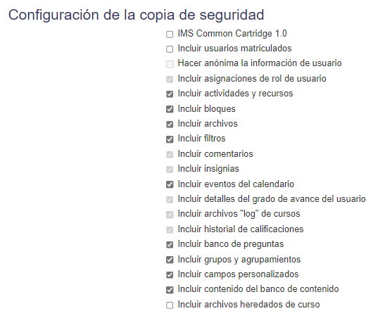
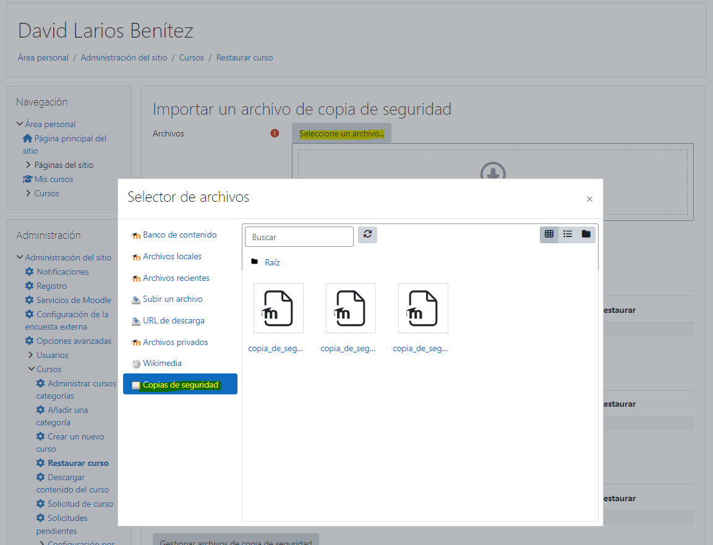
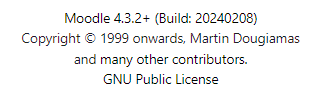
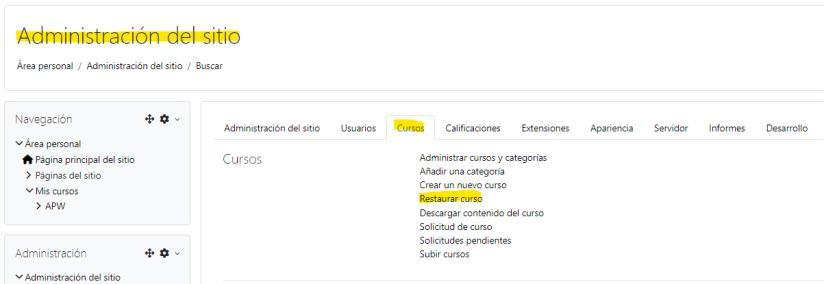
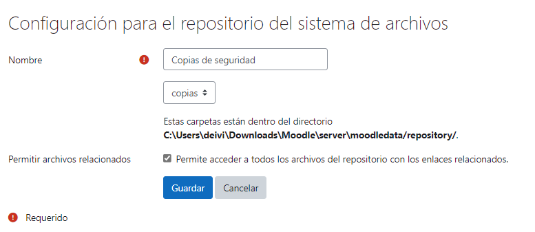

# Exportar e importar cursos entre Moodles

## Versión Moodle IES Castelar

**Versión:** `4.1.4`

No disponemos del rol de administrador y la versión no es visible al resto de roles. No obstante, al realizar una copia de seguridad del curso e importarla en el Moodle local, este es capaz de reconocerla.



## Versiones que funcionan en local (probadas)

**Versión:** `4.3.2+`

Funciona exportando e importando un curso individualmente, con las siguientes características de copia de seguridad:





## Exportar en el Moodle Original → Importar en el Moodle Local

Al restaurar el curso como curso nuevo, se selecciona la categoría destino:



> ⚠️ **No es posible exportar una copia de seguridad del Moodle Original completo**, al no ser administrador. Solo se pueden exportar cursos individuales.

## Error al importar cursos grandes

Cuando el curso es demasiado grande para importarlo, se produce un error de conexión al servidor:



### Solución: ajustar `php.ini`

Modificar inicialmente los parámetros de subida del fichero `php.ini`:

```ini
post_max_size = 5000M
upload_max_filesize = 5000M
max_execution_time = 600
memory_limit = 128M
```

Si esto no es suficiente, ver la solución alternativa mediante repositorio en [02 - Repositorio de archivos](02-repositorio-sistema-archivos.md).
