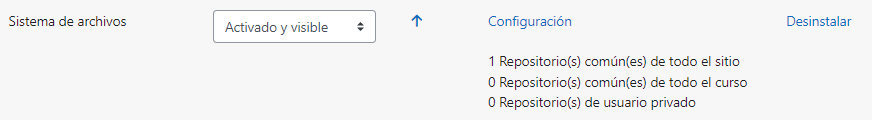
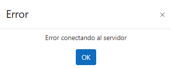
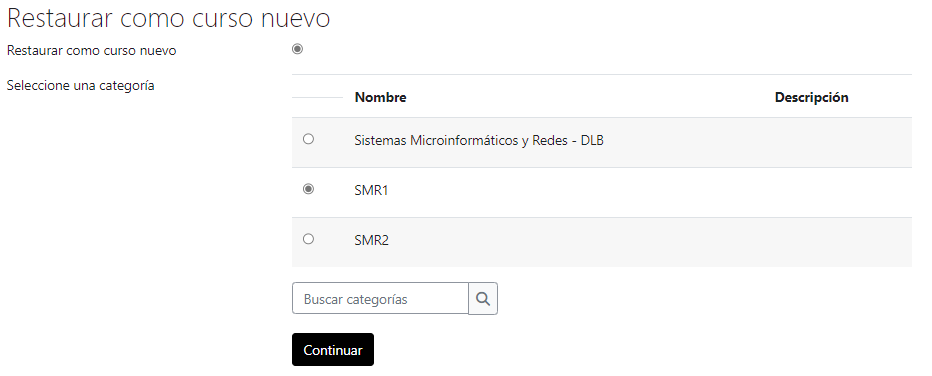

# Repositorio de archivos vía sistema de archivos (FTP simulado)

Cuando ajustar `php.ini` no es suficiente para importar cursos de gran tamaño, la solución es **crear un repositorio y simular la subida del fichero de recuperación vía FTP**.

Referencia oficial: [Repositorio sistema de archivos - MoodleDocs](https://docs.moodle.org/)

## 1. Crear la carpeta del repositorio

Crear la siguiente carpeta en el sistema:

```
C:\Users\deivi\Downloads\Moodle\server\moodledata\repository
```

## 2. Habilitar el repositorio "Sistema de archivos"

Ir a:

```
Administración > Administración del sitio > Plugins > Repositorios > Gestionar Repositorios
```



Activar el repositorio **Sistema de archivos** como "Activado y visible":



## 3. Configurar la ruta del repositorio

En la configuración del repositorio del sistema de archivos:

- **Nombre:** `Copias de seguridad`
- **Carpeta:** `copias`

Estas carpetas están dentro del directorio:

```
C:\Users\deivi\Downloads\Moodle\server\moodledata\repository\
```

Marcar **"Permitir archivos relacionados"** para acceder a todos los archivos del repositorio mediante enlaces relacionados.

## 4. Importar el archivo de copia de seguridad

Al restaurar un curso, en el selector de archivos aparecerá la opción **Copias de seguridad**, desde donde se pueden elegir los ficheros `.mbz` colocados previamente en la carpeta `repository`:



De esta forma se evita el error de conexión al servidor al subir ficheros de copia de seguridad muy grandes.
