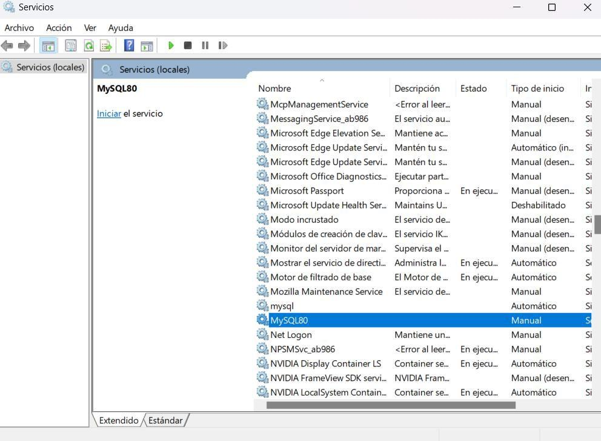

# Mover el directorio de instalación de Moodle

Al trasladar el directorio de instalación de Moodle a otro disco o equipo, hay que reconfigurar algunos ficheros para que la instalación siga funcionando.

## Pasos

1. **Ubicar la carpeta** en el nuevo destino (por ejemplo, otro disco duro o ruta).
2. **Ejecutar `Start Moodle.exe`** y escoger el **paso 1** del asistente.
3. **Editar el fichero de configuración**:

   ```
   \Moodle\server\moodle\config.php
   ```

   Modificar la línea:

   ```php
   $CFG->dataroot = 'NUEVA_RUTA_DEL_DIRECTORIO';
   ```

   sustituyendo `NUEVA_RUTA_DEL_DIRECTORIO` por la nueva ubicación del directorio `moodledata`.

4. Y ya estaría. ✅

## Antes de lanzar Moodle

Es necesario **detener (matar) los servicios de MySQL** que estén ocupando el puerto `3306`, ya que Moodle levanta su propia instancia de MySQL y entrará en conflicto si el puerto ya está en uso.



Pasos:

1. Abrir **Servicios** de Windows (`services.msc`).
2. Buscar el servicio **MySQL80** (u otro servicio MySQL en ejecución).
3. **Detenerlo** si está iniciado.
4. Lanzar Moodle normalmente.
